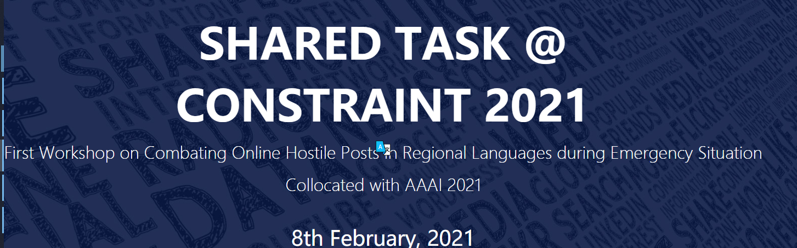

<div align=center>

</div>

[Constraint@AAAI2021 - COVID19 Fake News Detection in English](https://competitions.codalab.org/competitions/26655)

The third solution, including all codes, evaluation papers, and additional data and official data collected by us.

The paper has been accepted by AAAI 2021 first workshop on fighting online hostel posts in regional languages during emergency situation, and has been publicized at the seminar

## Title Description:
English covid19 fake news detection - this subtask focuses on detecting fake news related to covid19 in English. Data sources are various social media platforms, such as twitter, Facebook, instagram, etc. Given a social media post, the purpose of the sharing task is to classify it as fake news or real news.

### Task classification:

* Text classification
##Data Description:
`Constraint_ English_ Train. Xlsx` is an example of training samples given by the official, and is in xlsx data format. The data format is as follows:

|id|tweet|label|
|---|---|---|
|0|Alfalfa is the only cure for COVID-19.	|0|

## Model architecture:
Two models are used in this paper, which are based on bidirectional LSTM and transformers architecture respectively
1. bidirectional LSTM
2.text-transformers
## Calculation force requirements
Training on TPU of Google's kaggle platform
## Paper links
https://arxiv.org/abs/2101.02359


## To cite our work
```
@article{li2021exploring,
  title={Exploring text-transformers in aaai 2021 shared task: Covid-19 fake news detection in english},
  author={Li, Xiangyang and Xia, Yu and Long, Xiang and Li, Zheng and Li, Sujian},
  journal={arXiv preprint arXiv:2101.02359},
  year={2021}
}
```

------------------

Star if you are interested

**Thanks my teammate @[SwordFaith](https://github.com/SwordFaith)
